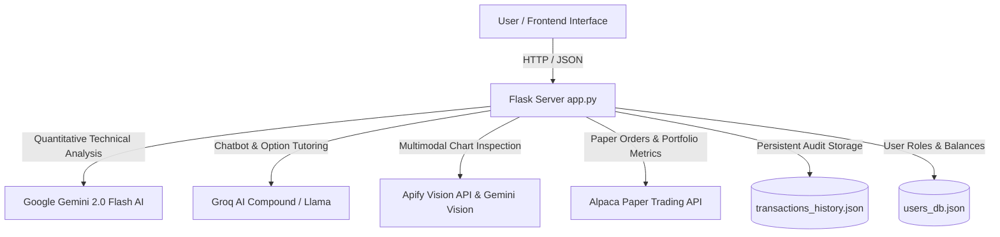

# ⚡ SOLINFINITE ALPHA V1 — Autonomous AI Trading & Options Intelligence Platform

> **Submitted for the Alpaca AI Trading Agents Hackathon 2026**  
> **Created & Developed by Team HyperNova Tech of HyperNova Technology**  
> 🔗 **Founder & Lead Architect:** [Ishan Pandit (LinkedIn Profile)](https://www.linkedin.com/in/ishan-pandit-4b2a7b388)

---


---

## 🌟 Executive Overview

**SOLINFINITE ALPHA V1** is an enterprise-grade autonomous AI algorithmic trading, options credit spread harvesting, and multimodal market analysis platform. Built with sub-millisecond AI decision logic, the system executes real paper trading orders on **US Stocks, ETFs, Options, and Crypto** via the **Alpaca Paper Trading API**.

The platform is designed around strict **AI Responsibility Separation**, separating quantitative strategy generation, chatbot user interaction, multimodal chart image vision analysis, and transaction database logging.

---

## 🔥 Key Platform Features

### 1. 📜 Separate Transaction Audit History Database (`transactions_history.json`)
- **Persistent JSON Database**: Keeps a complete record of every transaction executed by the 24/7 background AI engine, manual user orders, and automated profit-harvesting liquidations.
- **Unique Transaction Codes (`TX-ALPHA-XXXXX`)**: Every trade is tagged with a unique code (e.g. `TX-ALPHA-51042`, `TX-ALPHA-98241`).
- **Audit Metrics**: Logs timestamp, asset symbol, order side (`BUY`/`SELL`), quantity, entry price, RSI (14-period), MACD signals, confidence score, strategy name, and Gemini AI technical reasoning.
- **Interactive UI & Endpoint**: View live records in the UI table or query via `GET /api/transactions`.

### 2. 🤖 AI Chatbot with Unique Transaction Code Memory
- **Groq AI & Gemini 2.0 Flash Engine**: Powered by `groq/compound` with fallback to Gemini 2.0 Flash.
- **Full Database Memory Context**: The Chatbot reads `transactions_history.json` and prioritizes codes referenced in user prompts.
- **Explainable AI**: Ask the Chatbot *"Why did transaction TX-ALPHA-51042 fall and execute a sell?"* or click **"🤖 Ask AI Why"** in the UI to get a step-by-step breakdown of overbought RSI, MACD divergence, and risk protection rationale.

### 3. 🖼️ Multimodal Vision AI Chart Analysis (Apify & Gemini 2.0 Vision)
- **Pixel-Level Chart Inspection**: Upload chart snapshots or graphs directly into the Chatbot drawer.
- **Apify & Gemini Vision API**: Uses the Apify API and Gemini 2.0 Flash Vision to identify candlestick patterns (Hammer, Bullish Engulfing, Doji), trendlines, support/resistance rebound levels, and RSI skew.

### 4. 📈 4-Chart Multi-View (TradingView Integration)
- **Simultaneous Monitoring**: View up to 4 interactive stock/crypto charts side-by-side (SPY, NVDA, BTC/USD, AAPL, QQQ, TSLA).
- **1-Click Actions**: Execute quick paper buys or prompt the AI Chatbot directly from any chart window.

### 5. 🎵 Spicetify Free Streaming Music Engine
- Embedded audio stream visualizer with live music search, station presets (Lo-Fi, Synthwave, Cyberpunk, Chillout), beat-reactive fluid canvas integration, and full Spotify embeds.

### 6. 💡 Quant Billionaire Trader Insights & Live Market News Radar
- **Random Billionaire Quotes**: Published quotes and risk management principles from Warren Buffett, Jim Simons, Ray Dalio, Paul Tudor Jones, and George Soros.
- **Live News Radar**: Daily market news covering portfolio stocks (SPY, NVDA, AAPL, BTC, TSLA) with images, sentiment scores, and direct online links to Bloomberg, WSJ, Reuters, and MarketWatch.
- **Post of the Week**: Deep-dive weekly quantitative strategy research spotlight.

### 7. 💳 UPI Paper Fund Deposit & PDF Audit Report Generator
- Instant paper account top-up via UPI QR code / UPI ID verification.
- 1-Click print-ready **PDF Audit Report** generation for official hackathon submission and audit recordkeeping.

---

## 🏗️ System Architecture & AI Responsibility Separation



---

## 💻 Local Installation & Setup

1. **Clone the Repository**:
   ```bash
   git clone https://github.com/ProGamerz17008/solinfinite-alpha-v1.git
   cd solinfinite-alpha-v1
   ```

2. **Create Virtual Environment & Install Dependencies**:
   ```bash
   python -m venv venv
   # On Windows:
   venv\Scripts\activate
   # On Mac/Linux:
   source venv/bin/activate

   pip install -r requirements.txt
   ```

3. **Configure Environment Variables (`.env`)**:
   Create a `.env` file in the root directory (do not commit `.env` to GitHub):
   ```env
   ALPACA_API_KEY=YOUR_ALPACA_API_KEY
   ALPACA_SECRET_KEY=YOUR_ALPACA_SECRET_KEY
   GEMINI_API_KEY=YOUR_GEMINI_API_KEY
   GROQ_API_KEY=YOUR_GROQ_API_KEY
   APIFY_API_KEY=YOUR_APIFY_API_KEY
   ADMIN_EMAIL=founder.hypernovatechnology@gmail.com
   ```

4. **Launch Application**:
   ```bash
   python app.py
   ```
   Open your browser and navigate to `http://127.0.0.1:5000`.

---

## 🛠️ API Reference Summary

| Endpoint | Method | Description |
| :--- | :--- | :--- |
| `GET /` | `GET` | Main Platform Dashboard |
| `GET /api/account` | `GET` | Live Alpaca Equity, Cash, and Buying Power |
| `GET /api/positions` | `GET` | Active Paper Positions (Stocks & Crypto) |
| `GET /api/transactions` | `GET` | Full Transaction Audit History (`transactions_history.json`) |
| `POST /api/analyze-and-trade` | `POST` | Trigger Gemini 2.0 Flash AI quantitative review & execution |
| `POST /api/chat` | `POST` | Groq/Gemini Chatbot prompt with Vision AI image inspection |
| `POST /api/deposit-upi` | `POST` | Paper money account top-up |
| `GET /api/download-report-pdf` | `GET` | Generate printable PDF performance audit report |

---

## 👥 Credits & Attribution

**SOLINFINITE ALPHA V1** is proudly created and developed by:

**Team HyperNova Tech**  
*HyperNova Technology AI Quantitative Division*  
🔗 **Founder & Lead Engineer:** [Ishan Pandit (LinkedIn Profile)](https://www.linkedin.com/in/ishan-pandit-4b2a7b388)  
📧 **Contact Email:** founder.hypernovatechnology@gmail.com

*Submitted for the Alpaca AI Trading Agents Hackathon 2026.*
